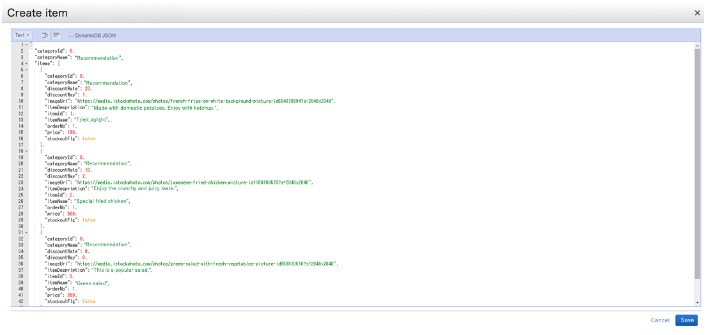

# Input test data

- Input test data to DynamoDB

  Test data must be submitted for this app to work.
  Put the test data into the table with the table name set in RegisterCouponInfoDBName and RegisterItemInfoDBName in template.yaml when deploying the app.
  The test data is as follows.
  - RegisterItemInfoDBName table
  backend/APP/dynamodb_data/SmaRegiItemInfo/のsmart_register_item_1.json ~ smart_register_item_5.json
  - RegisterCouponInfoDBName table
  backend/APP/dynamodb_data/SmaRegiCouponInfo/のsmart_register_coupon_1

  Paste and submit the data in the DynamoDB console of the AWS management console. (*See image below)

  [Input test data]
  

[Next page](validation.md)

[Back to Table of Contents](README_en.md)
