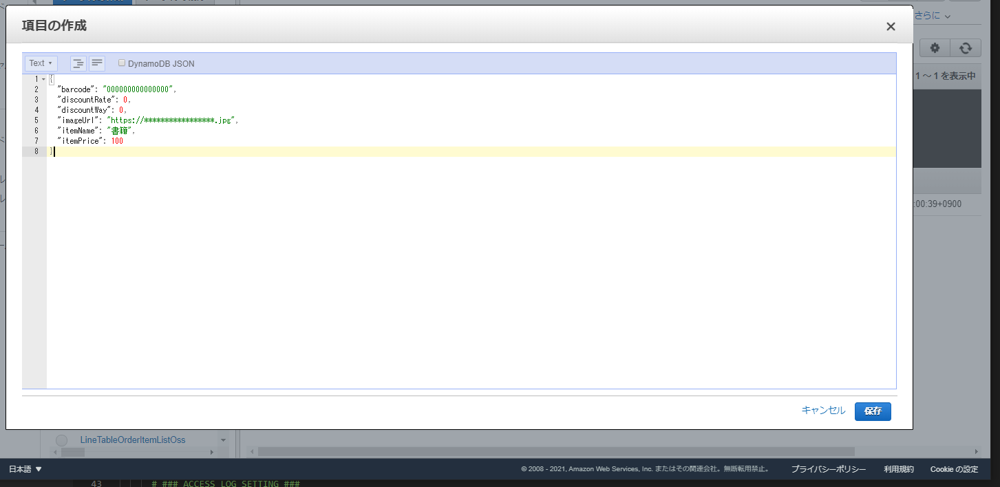

# テストデータの投入
- DynamoDB へテストデータの投入  
  本アプリの動作にはテストデータを投入する必要があります。
  アプリデプロイ時に template.yaml の RegisterCouponInfoDBName、RegisterItemInfoDBName に設定したテーブル名のテーブルに、テストデータを投入してください。
  テストデータは以下の通りです。
  - RegisterItemInfoDBNameのテーブル
  backend/APP/dynamodb_data/SmaRegiItemInfo/のsmart_register_item_1.json ~ smart_register_item_5.json
  - RegisterCouponInfoDBNameのテーブル
  backend/APP/dynamodb_data/SmaRegiCouponInfo/のsmart_register_coupon_1

  データはAWSマネジメントコンソールの DynamoDB コンソールにて、ペーストして投入します。(※以下画像参照)  

  【テストデータの投入】
  

[次の頁へ](validation.md)

[目次へ戻る](../../README.md)
